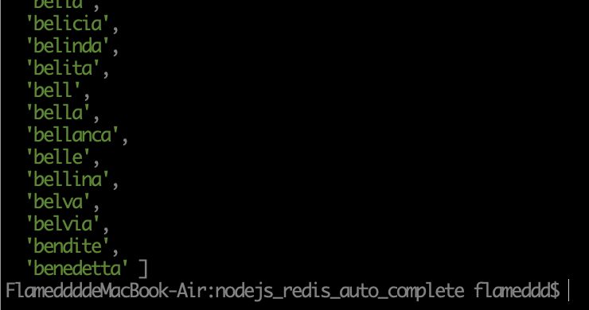

## inspire by Salvatore Sanfilippo aka antirez
- [Auto Complete with Redis](http://oldblog.antirez.com/post/autocomplete-with-redis.html)

### tags
 - `nodejs`, `redis`, `auto complete`

## prerequire
### redis
> docker run -d -p 6379:6379 --name autoCompleteRedis redis:latest


## env
```
  host: process.env.REDIS_HOST || 'localhost',
  port: process.env.REDIS_PORT || '6379',
  password: process.env.REDIS_PASS || '',
```

## install
> npm install

## start
> npm start

### screen shot
